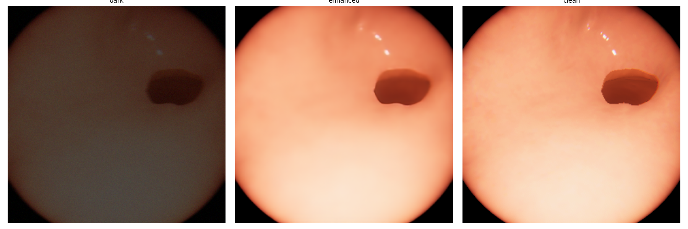
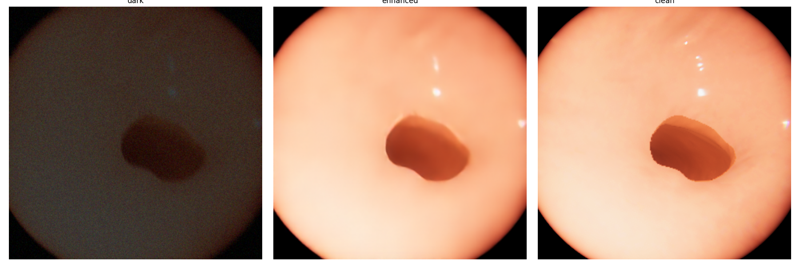
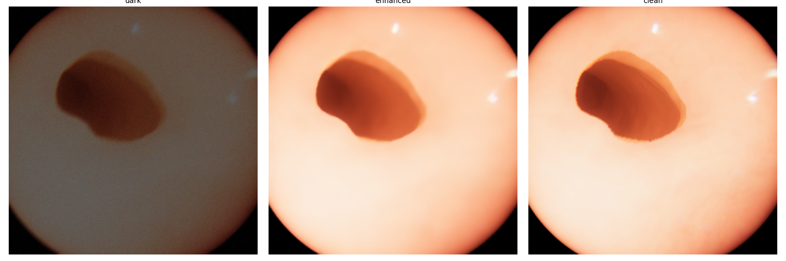

# Phase 5 Report: Does Brightening First Actually Help?

**Question:** does running a dark endoscope frame through DarkIR-lite
*before* Mini-3D-Recon produce a better 3D reconstruction than feeding the
same dark frame straight in?

**Answer: yes, clearly, on every metric measured.**

## Setup

- **Data**: UnityCam **test split** (held out from both Phase 2's DarkIR-lite
  fine-tuning and Phase 3's Mini-3D-Recon training — this is the first
  genuinely unseen evaluation of either model).
- **Degradation**: each test frame is synthetically darkened
  (`src/data/dark_degradation.py` — blur + gamma attenuation + noise,
  DarkIR's own image-formation model) using a seed keyed to its dataset
  index, so both conditions below see **byte-identical dark input** — the
  only variable being compared is whether DarkIR-lite runs in between.
- **Condition A — `raw_dark_input`**: dark frame -> Mini-3D-Recon.
- **Condition B — `darkir_lite_enhanced`**: dark frame -> DarkIR-lite
  (Phase 2 checkpoint) -> Mini-3D-Recon.
- **Metrics**: depth AbsRel/RMSE/delta1 (median-ratio scaled — this
  project never confirmed absolute depth units, so scale-ambiguous
  comparison is the correct methodology, matching the official EndoSLAM
  repo's own `eval_depth.py`) and trajectory ATE/RPE (Umeyama-aligned —
  predicted pose translation is in raw, uncalibrated units). See
  `src/eval/metrics.py`.
- Full run: `notebooks/phase5_evaluation` (kernel
  `endoslam-phase5-evaluation`, version 2, `COMPLETE`), raw numbers in
  `phase5_metrics.json`.

## Results

| Metric | `raw_dark_input` | `darkir_lite_enhanced` | Improvement |
|---|---|---|---|
| Depth AbsRel ↓ | 0.327 | 0.227 | **30.4% lower** |
| Depth RMSE ↓ | 11.011 | 7.244 | **34.2% lower** |
| Depth delta1 ↑ | 0.398 | 0.680 | **+28.3 points (71% relative)** |
| ATE ↓ | 0.00724 | 0.00582 | **19.6% lower** |
| RPE translation RMSE ↓ | 0.001546 | 0.000963 | **37.7% lower** |
| RPE rotation RMSE (deg) ↓ | 1.127° | 0.582° | **48.4% lower** |

(↓ = lower is better, ↑ = higher is better)

Every single metric improves with DarkIR-lite in the loop — depth quality,
absolute trajectory accuracy, and frame-to-frame relative pose accuracy all
move in the same direction. Rotation error in particular is cut nearly in
half, and the fraction of "good" depth pixels (delta1) almost doubles.

## Visual comparison

Three examples from the test split — dark input (what Mini-3D-Recon sees in
Condition A) | DarkIR-lite enhanced (what it sees in Condition B) | clean
reference (ground truth, not seen by either model):

DarkIR-lite's output is visually close to the clean reference in all three
cases — texture, tissue-fold detail, and specular highlights that are
completely lost in the dark frame are recovered.

## Interpretation

This confirms the project's core hypothesis: for this dark-endoscope /
synthetic-degradation setup, brightening first is not just a
preprocessing nicety — it measurably improves both the depth estimation and
the pose-chaining that Phase 4's 3D reconstruction depends on. The gain is
largest on rotation accuracy (48%) and depth delta1 (71% relative),
suggesting the raw-dark model's biggest failure mode is losing fine detail
needed for accurate frame-to-frame correspondence, not just a uniform
brightness/contrast handicap.

One caveat worth stating plainly: the test split is small (148 UnityCam
windows), so these numbers are a clear directional result on this dataset,
not a statistically exhaustive study — consistent with this project's
1-person/30-day scope.
